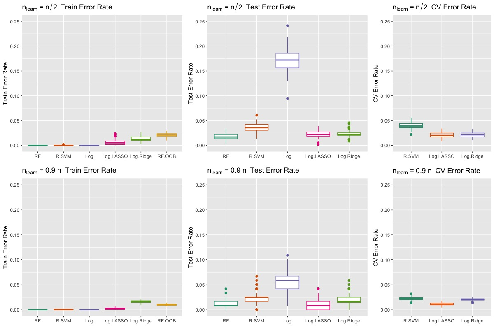
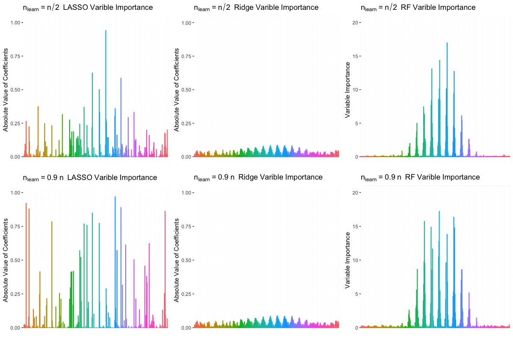
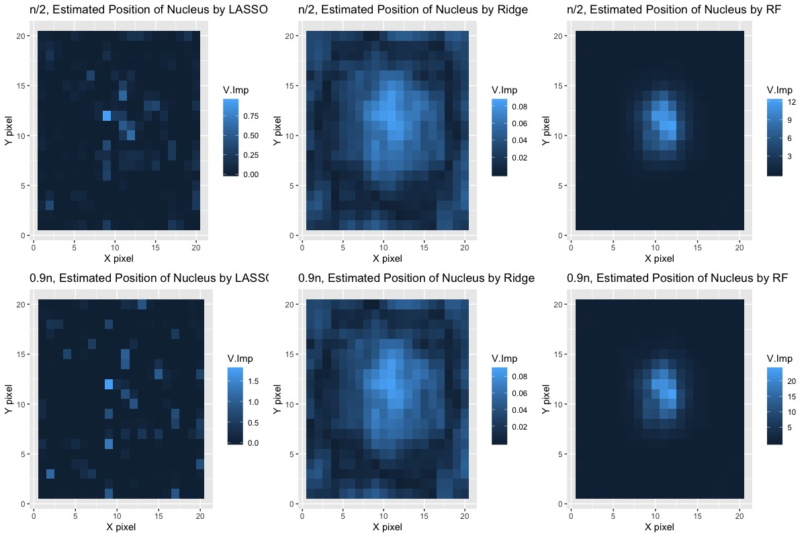

# Cell Image Classification by Nucleus

Soonmo Seong (soonmo.seong@gmail.com)

Jan 3rd, 2020

[Analysis Report, including mathematical approches](https://drive.google.com/open?id=1iybkj00lmuhgsGshC2U2xrCKo7obpWWR)

## Brief Summary

This is a brief summary of this project. If you are curious aobut details and code, please check the linked analysis report and R code above.

**The purpose is which machine learning algorithm shows the best performace from this dataset and whether the data size matters or not. And, we estimate the possible location of a nucleus in cell.**

**Random Forest is the best algorithm for this dataset.** Regardless of the train data size, Random Forest marks the lowest test error rate with the shortest training time. In addition, increasing the size of train data improves the test error rate for Random Forest. Let me explain why Random Forest is the best.

### Data Description

This dataset comes from [Kaggle](https://www.kaggle.com/zicouc/pixelss-intensity-of-positive-and-negative-nuclei). The sample size is 1185, and this dataset is for binary classification. The dataset with nucleus(=1) are 43% , and the dataset without nucleus(=0) are 57%. That is to say, this dataset is imbalanced. Oversampling is applied in order to handle the imbalance. The number of variables is 400 because each data point is 20 x 20 gray-scaled image.

### Concept of Analysis

In order to figure out the best algorithm for this data, five classification algorithms are compared each other in terms of performance by 100 iterations.

- Radial Support Vector Machine(R-SVM)
- Random Forest(RF)
- Logistic regression
- LASSO logistic regression
- Ridge logistic regression

10 fold cross validation is applied to tune hyper parameters for radial support vector machine, lasso logistic regression, and ridge logistic regression.

In addition to the misclassification error rate comparison, we evaluate whether increasing the size of train data improves the performance. As below, we consider two cases of train data size, denoted by n_learn.

|                    | n_learn = 0.5n | n_learn = 0.9n |
| ------------------ | -------------- | -------------- |
| Size of train data | 0.5n           | 0.9n           |
| Size of test data  | 0.5n           | 0.1n           |

### Performance Comparison

Given the size of train data = 0.5n, Random Forest(RF) is the best, and logistic regression the worst because it's overfitted. Cross validation error rates are good estimates of test error rates. Interestingly, RF Out-Of-Bag error in train error rates is also a good estimate of test error rate.

R-SVM takes the longest time to cross validate for this dataset although the test error rate is the second worst, and RF is the fastest one with the best test error rate.

Like n_learn = 0.5n, there are similar patterns in n_learn = 0.9n. However, overfitting in n_learn = 0.9n is less severe than n_learn = 0.5n. That is, increasing the size of train data improves overfiting and test misclassification error rates.

When n_learn = 0.9n, it however takes time to cross validate and fit three time as much as when n_learn = 0.5n. Increasing the size of train data from 0.5n to 0.9n improves test error rates in most algorithm.

### Trade Off Between Time and Performance

| **Method**    | Difference in **Test Error Rate(%)** |
| ------------- | ------------------------------------ |
| Ridge         | m= 0.2, p-value = 0.14 > 0.05        |
| LASSO         | m = 1.1, p-value = 4e-12 < 0.05      |
| SVM           | m = 1.4, p-value = 9e-14 < 0.05      |
| Random Forest | m = 0.6, p-value = 2e-7 < 0.05       |

0.9n takes time to cross validate and fit three times as much as 0.5n. Test error rates are also improved except ridge regression by A/B testing on two different train data size. As the p-value of two sample test is 0.14, which is greater than 0.05, we don't need to increase the size of train data if we use ridge logistic regression.

### Variable Importance

Regarding variable importance, lasso regression, ridge regression, and RF show central tendency in general.

### Estimated Location of Nucleus in Cell

From the heatmap based on the variable importance, we can clearly see that pixels around center are more important than other pixels. We can predict that cell images configuration from ridge and nucleus's location in cell generally.

### Conclusion

As n_learn increases upto 90 percentage of n, time to cross-validate and to fit increases more than twice in general. Ridge doesn’t improve test error rate as nlearn increases. LASSO reduces test error rate in half, the most affected by increasing n_learn. Radial SVM spends much more time, but results in the worse test error rate. Important variables are pixels around the center of cell images.

The best method for this dataset is Random Forest in terms of test error rate and time. The larger n_learn improves test error rates except for ridge regression. R-SVM is the worst method for this dataset.
